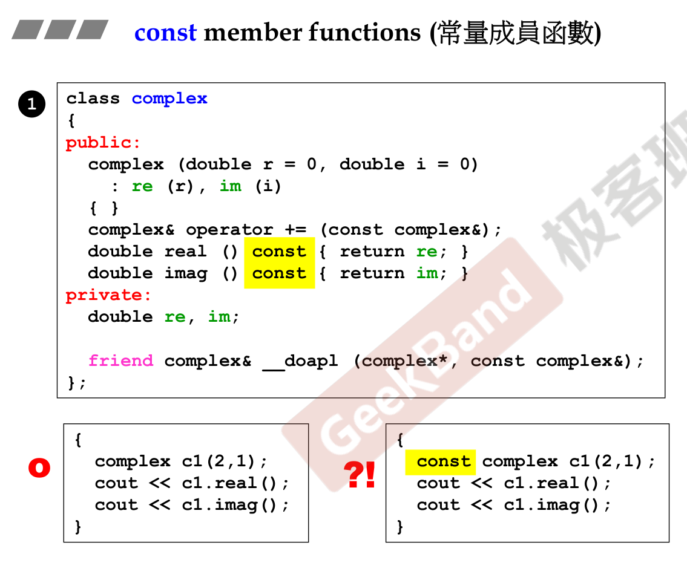
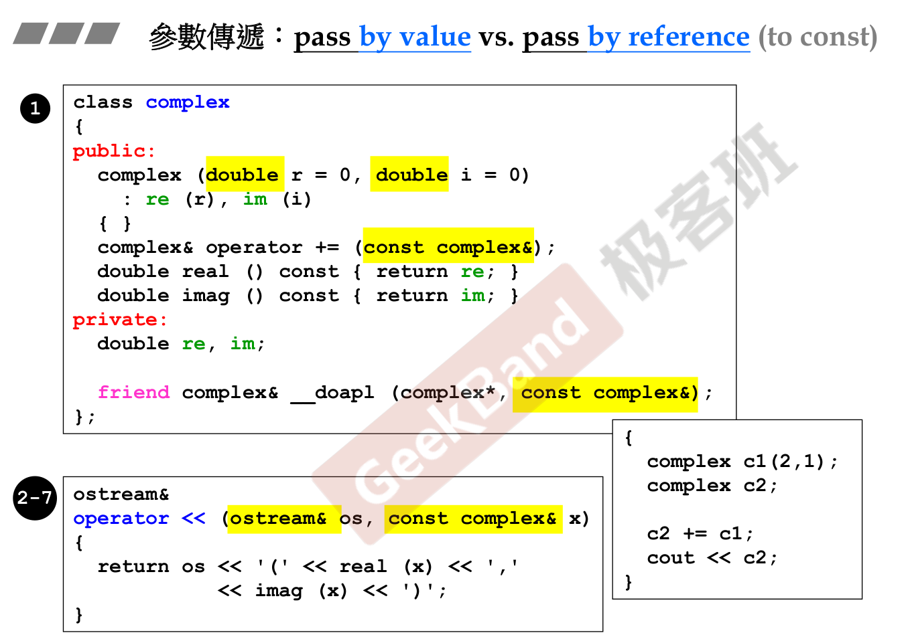
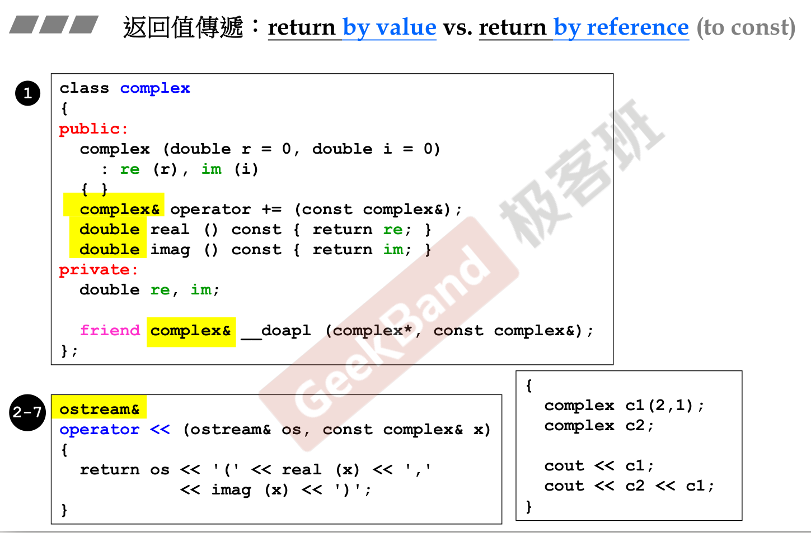
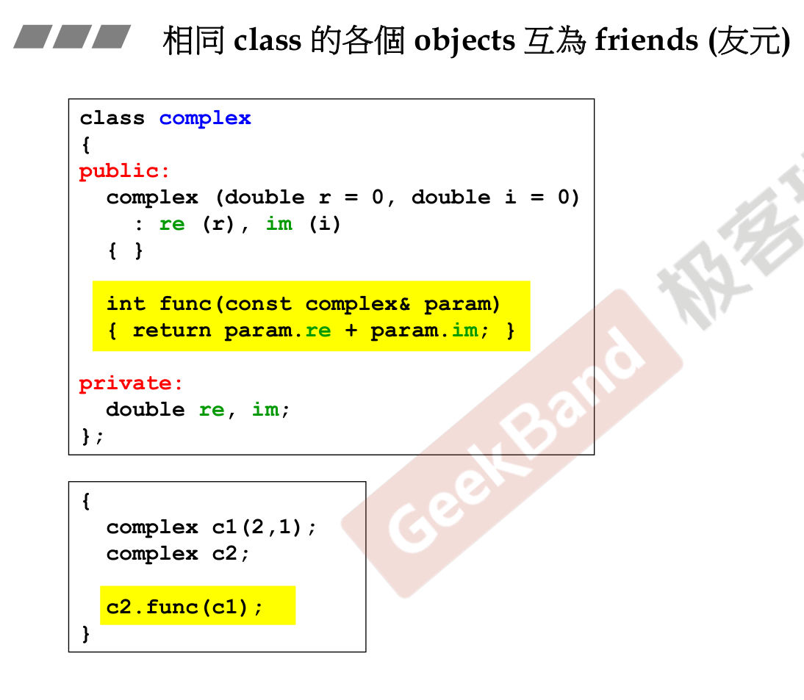
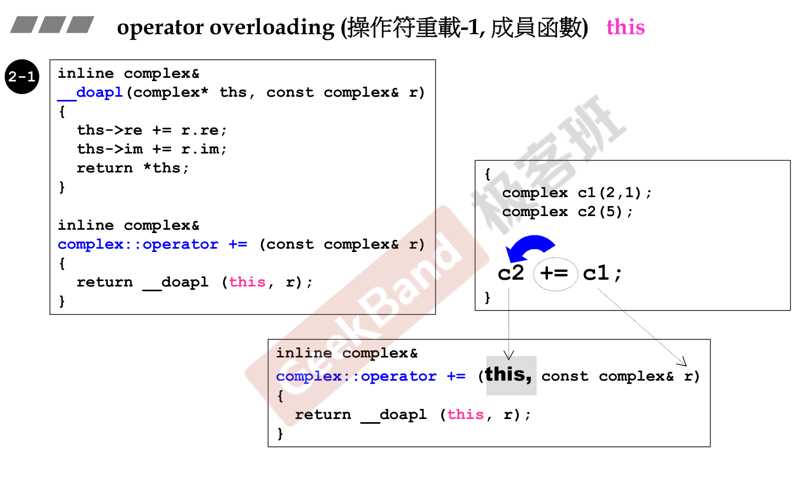
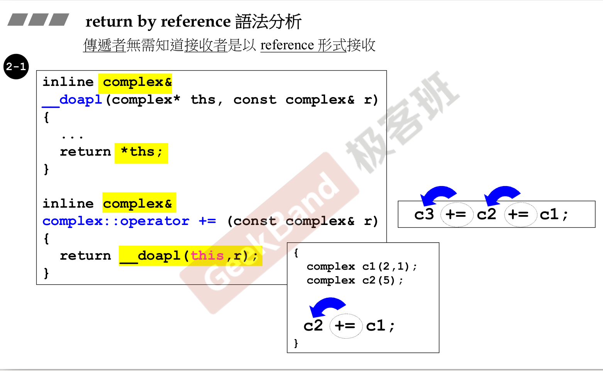
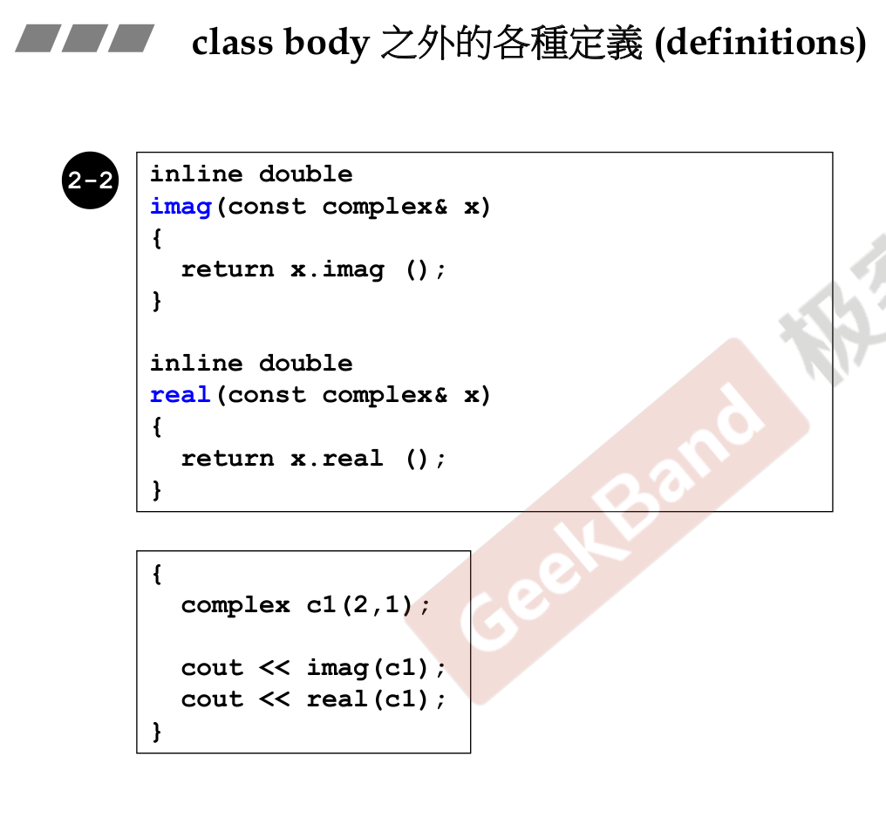
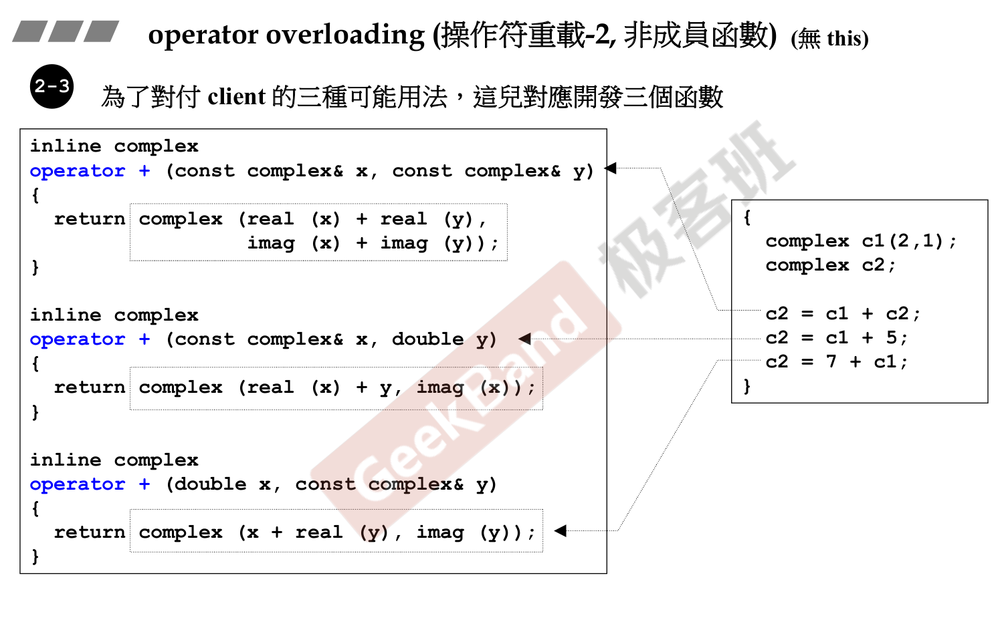
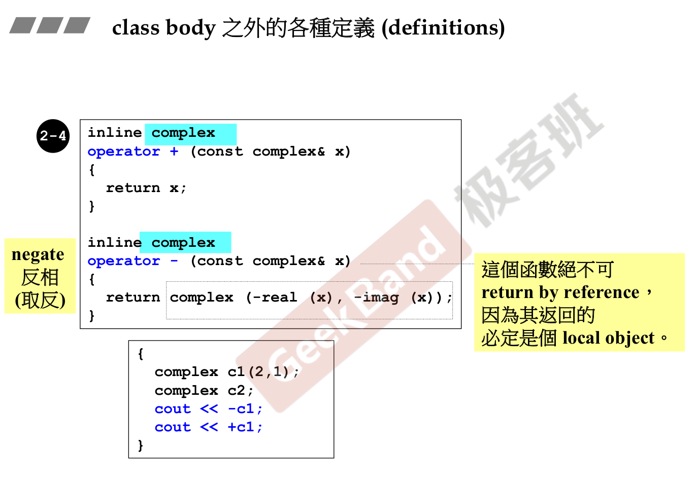
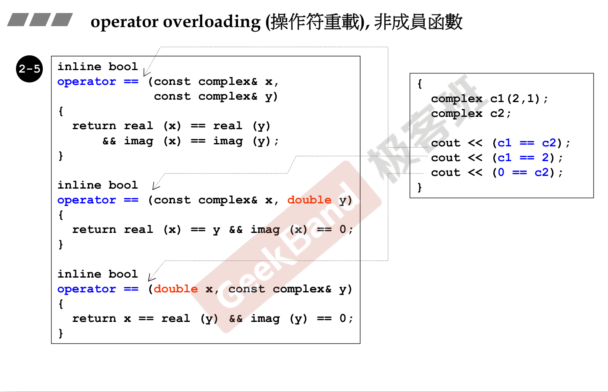

### 构造函数在private


### 常量成员函数




- const 修饰函数

- const 修饰变量


### 参数传递




传value，根据不同系统跟数据会消耗不同byte，速度慢

传引用，速度快，const引用，不能修改，并且要尽量传引用


### 返回值传递



### 友元


### 同一个class的各个object互为friend



### 引用的传递和返回的情况

函数的操作结果放置：

- 某个已经有的变量位置

- 必须在函数里面创建的local变量：不可以返回引用


### 操作符重载-1,成员函数



### return by reference





### 操作符重载-2，非成员函数



不可以返回reference，这是一个临时量

typename() 创建临时变量






cout << 只能全局函数重载

因为cout为标准库中的，不可能认识<<这个符号，所以只能写成全局函数重载

cout是一个object，type是ostream

重载时第一参数一定不能是const


编程示例

```
#ifndef __MYCOMPLEX__
#define __MYCOMPLEX__

class complex
{
public:
  complex (double r = 0, double i = 0): re (r), im (i) { }
  complex& operator += (const complex&);
  complex& operator -= (const complex&);
  complex& operator *= (const complex&);
  complex& operator /= (const complex&);
  double real () const { return re; }
  double imag () const { return im; }
private:
  double re, im;

  friend complex& __doapl (complex *, const complex&);
  friend complex& __doami (complex *, const complex&);
  friend complex& __doaml (complex *, const complex&);
};


#endif   //__MYCOMPLEX__

```

